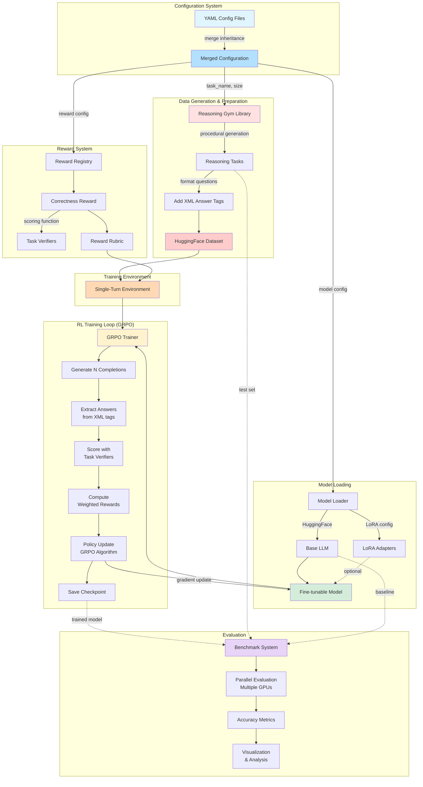
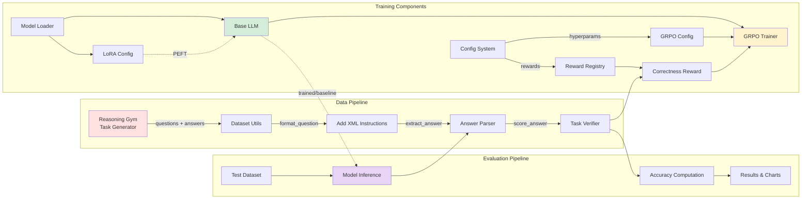
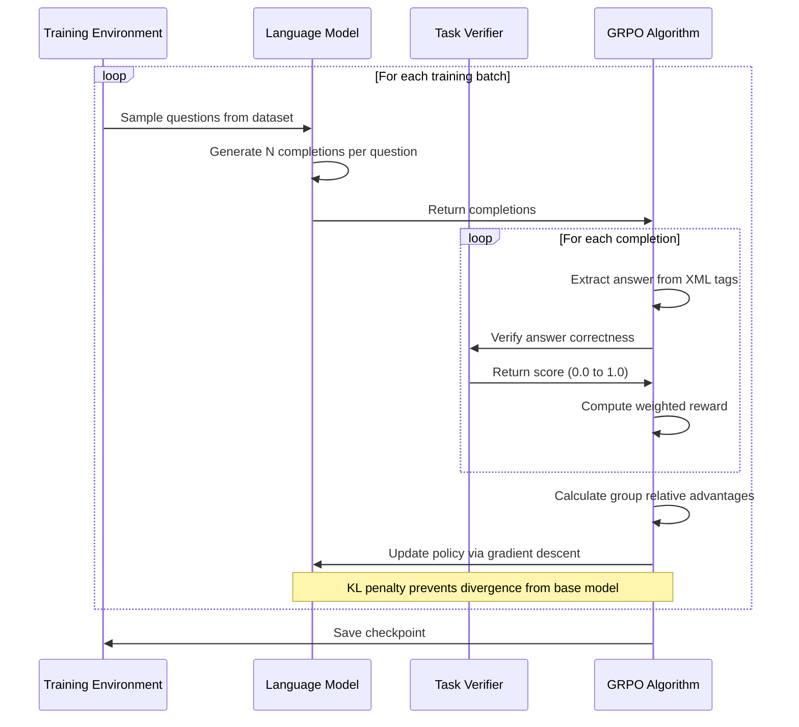
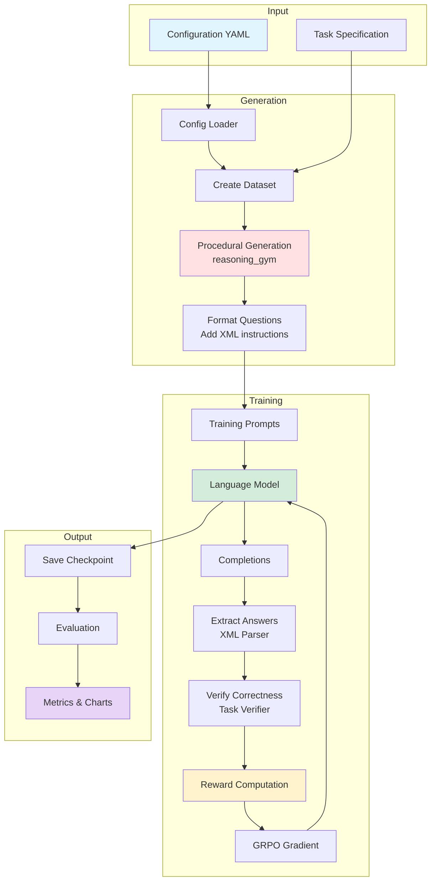
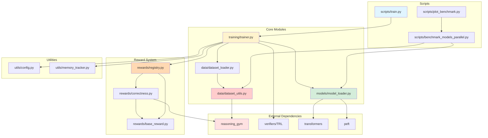

# Architecture: RL Training Pipeline for Reasoning Tasks

This document presents the architecture of our reinforcement learning training pipeline for language models on procedurally-generated reasoning tasks.

## System Architecture Overview



## Component Detail Diagram



## Training Loop Detail



## Data Flow Architecture



## Module Dependency Graph



## Key Architecture Principles

### 1. Unified Dataset Handling
Both training and evaluation use identical functions from `src/data/dataset_utils.py`:
- `format_question()` - Adds XML answer tags
- `extract_answer_from_response()` - Parses model outputs
- `score_answer()` - Verifies correctness using task verifiers

This ensures consistency between training and evaluation.

### 2. Verifier-Driven Learning
The architecture leverages procedurally-generated tasks with built-in verification:
```
Question → Model → Answer → Verifier → Reward → Policy Update
```

This enables scalable training without human labeling.

### 3. Config-Based Design
All experiments are defined through YAML configs with inheritance:
```
base.yaml + model.yaml + task.yaml + experiment.yaml → Training Run
```

No code changes needed for new tasks, models, or hyperparameters.

### 4. Modular Reward System
Registry pattern enables composable rewards:
```python
rewards:
  - name: "correctness"
    weight: 0.8
  - name: "brevity"
    weight: 0.2
```

### 5. Parameter-Efficient Training
LoRA (Low-Rank Adaptation) enables fine-tuning large models:
```
Base Model (frozen) + LoRA Adapters (trainable) = Efficient Fine-tuning
```

## Training Pipeline Flow

1. **Configuration Loading**
   - Load YAML config with inheritance
   - Deep merge base + model + task + experiment configs

2. **Data Preparation**
   - Generate reasoning tasks via reasoning_gym
   - Format questions with XML answer instructions
   - Create HuggingFace Dataset

3. **Reward Setup**
   - Initialize reward functions from registry
   - Create reward rubric with weights
   - Connect to task verifiers

4. **Environment Creation**
   - Wrap dataset + rubric in SingleTurnEnv
   - Define state space (questions) and action space (completions)

5. **Model Loading**
   - Load base LLM from HuggingFace
   - Apply LoRA configuration if enabled
   - Configure tokenizer and special tokens

6. **Training Execution**
   - GRPO loop: generate → extract → verify → reward → update
   - Save checkpoints at specified intervals
   - Log metrics to WandB (optional)

7. **Evaluation**
   - Parallel benchmarking across multiple GPUs
   - Test on held-out tasks
   - Generate accuracy metrics and visualizations

## Evaluation Pipeline Flow

1. **Dataset Creation**
   - Generate fixed test sets (same seed for reproducibility)
   - Use identical formatting as training

2. **Model Loading**
   - Support for HuggingFace models and local checkpoints
   - Automatic LoRA adapter detection

3. **Parallel Execution**
   - Create all (task, model) combinations
   - Round-robin GPU assignment
   - Concurrent evaluation

4. **Scoring**
   - Generate completions with temperature sampling
   - Extract answers using XML parser
   - Verify with task verifiers
   - Compute accuracy metrics

5. **Result Aggregation**
   - Per-task JSON results
   - Multi-task summary statistics
   - Comparison visualizations

## File Structure

```
reasoning-gym/
├── configs/                          # Configuration files
│   ├── base.yaml                     # Default hyperparameters
│   ├── models/                       # Model-specific configs
│   ├── tasks/                        # Task-specific configs
│   └── experiments/                  # Experiment compositions
│
├── src/                              # Core library
│   ├── data/                         # Dataset handling
│   │   ├── dataset_utils.py          # Unified utilities
│   │   └── dataset_loader.py         # Dataset creation
│   ├── models/                       # Model loading
│   │   └── model_loader.py           # HF + LoRA loading
│   ├── rewards/                      # Reward functions
│   │   ├── base_reward.py            # Abstract base
│   │   ├── correctness.py            # Correctness reward
│   │   └── registry.py               # Reward factory
│   ├── training/                     # Training logic
│   │   └── trainer.py                # GRPO orchestration
│   └── utils/                        # Utilities
│       ├── config.py                 # Config loading
│       └── memory_tracker.py         # Memory profiling
│
├── scripts/                          # Executable scripts
│   ├── train.py                      # Training entry point
│   ├── benchmark_models_parallel.py  # Evaluation system
│   └── plot_benchmark.py             # Visualization
│
├── experiments/                      # Training outputs
└── benchmark_results/                # Evaluation results
```

## External Dependencies

- **reasoning_gym**: Procedurally-generated reasoning tasks with verification
- **verifiers/TRL**: GRPO trainer implementation
- **transformers**: HuggingFace model loading and tokenization
- **peft**: Parameter-efficient fine-tuning (LoRA)
- **datasets**: HuggingFace datasets library
- **torch**: PyTorch deep learning framework
- **wandb**: Experiment tracking (optional)

## Technical Innovations

1. **Universal Answer Format**: XML tags work across all task types
2. **Automatic Verification**: Built-in verifiers enable scalable RL training
3. **Unified Pipeline**: Same code for training and evaluation
4. **Composable Rewards**: Registry pattern for extensible reward functions
5. **Parallel Evaluation**: Multi-GPU benchmarking of multiple models
6. **Config Inheritance**: Hierarchical configuration system
7. **Memory Optimization**: LoRA + gradient checkpointing for large models
