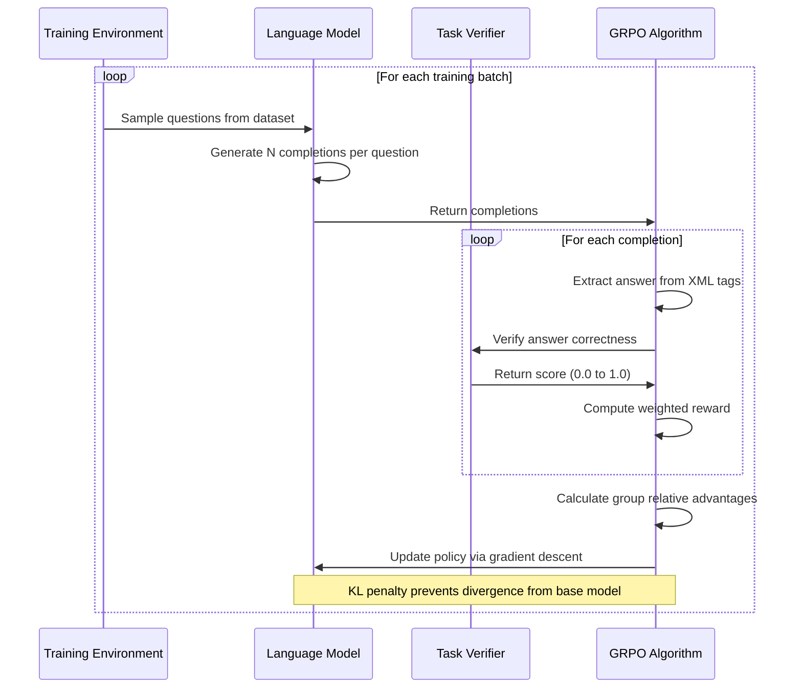

# Training Loop

```mermaid
sequenceDiagram
    participant Env as Training Environment
    participant Model as Language Model
    participant Verifier as Task Verifier
    participant GRPO as GRPO Algorithm

    loop For each training batch
        Env->>Model: Sample questions from dataset
        Model->>Model: Generate N completions per question
        Model->>GRPO: Return completions

        loop For each completion
            GRPO->>GRPO: Extract answer from XML tags
            GRPO->>Verifier: Verify answer correctness
            Verifier->>GRPO: Return score (0.0 to 1.0)
            GRPO->>GRPO: Compute weighted reward
        end

        GRPO->>GRPO: Calculate group relative advantages
        GRPO->>Model: Update policy via gradient descent
        Note over GRPO,Model: KL penalty prevents divergence from base model
    end
```